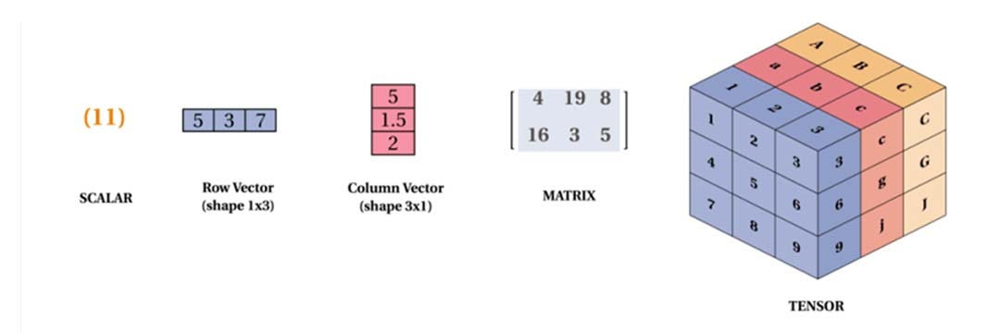
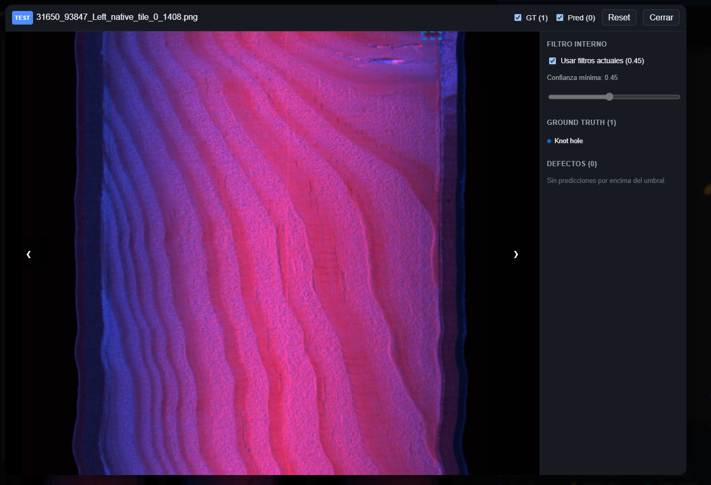
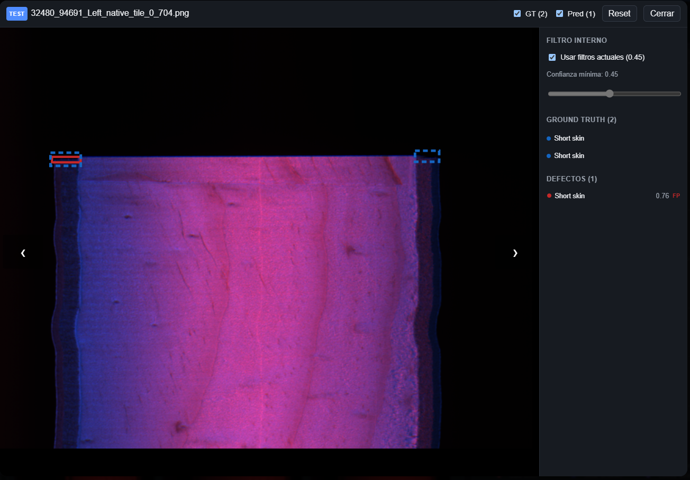
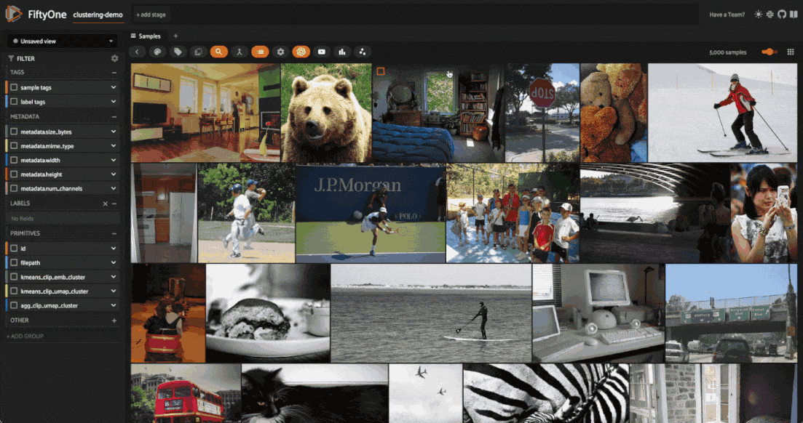
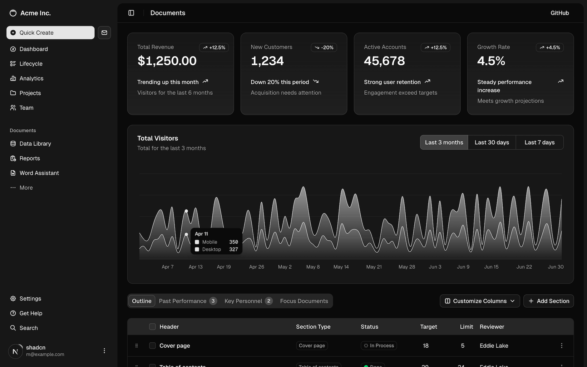

# Visualizer Backend — Guía de referencia

Esta guía explica cómo funciona el backend del visualizador **sin asumir conocimientos de redes neuronales**. Primero explica los conceptos que necesitas, y luego recorre el código módulo a módulo.

---

## Índice

0. [Como poner en marcha el proyecto](#0-poner-en-marcha-el-proyecto-instalaciones-y-dependencias)
1. [Conceptos de IA que necesitas saber](#1-conceptos-de-ia-que-necesitas-saber)
2. [Qué hace este backend en una frase](#2-qué-hace-este-backend-en-una-frase)
3. [Mapa del código](#3-mapa-del-código)
4. [Cómo arranca todo — `app.py`](#4-cómo-arranca-todo--apppy)
5. [Flujo principal: inferencia y evaluación — `jobs.py`](#5-flujo-principal-inferencia-y-evaluación--jobspy)
6. [El modelo — `models/`](#6-el-modelo--models)
7. [El dataset — `datasets/`](#7-el-dataset--datasets)
8. [Comparar predicciones con ground truth — `evaluator.py`](#8-comparar-predicciones-con-ground-truth--evaluatorpy)
9. [Guardar resultados — `store.py`](#9-guardar-resultados--storepy)
10. [Búsqueda semántica — `semantic_search/`](#10-búsqueda-semántica--semantic_search)
11. [Tipos de datos compartidos](#11-tipos-de-datos-compartidos)
12. [El registro — `registry.py`](#12-el-registro--registrypy)
13. [Cómo añadir soporte para un modelo nuevo](#13-cómo-añadir-soporte-para-un-modelo-nuevo)
14. [Cómo añadir soporte para un dataset nuevo](#14-cómo-añadir-soporte-para-un-dataset-nuevo)
15. [Objetivos mientras ye esté en Garnica](#15-objetivos-del-proyecto)

Creo que los puntos [0](#0-poner-en-marcha-el-proyecto-instalaciones-y-dependencias) y [1](#1-conceptos-de-ia-que-necesitas-saber) son bastante importantes, ya que son cosas que necesitarás entender antes de empezar con el desarrollo. No tienes que ser un experto (sobre todo en los conceptos de la IA, apartado [1](#1-conceptos-de-ia-que-necesitas-saber)), pero que al menos te suenen.

Para entender el backend, tienes los puntos
[2](#2-qué-hace-este-backend-en-una-frase),
[3](#3-mapa-del-código),
[4](#4-cómo-arranca-todo--apppy),
[5](#5-flujo-principal-inferencia-y-evaluación--jobspy),
[6](#6-el-modelo--models),
[7](#7-el-dataset--datasets),
[8](#8-comparar-predicciones-con-ground-truth--evaluatorpy),
[9](#9-guardar-resultados--storepy),
[10](#10-búsqueda-semántica--semantic_search),
[11](#11-tipos-de-datos-compartidos),
[12](#12-el-registro--registrypy),
[13](#13-cómo-añadir-soporte-para-un-modelo-nuevo) y
[14](#14-cómo-añadir-soporte-para-un-dataset-nuevo).
Es especialmente importante el punto [10](#10-búsqueda-semántica--semantic_search), ya que es una funcionalidad que todavía no está del todo bien y con la que tendrás que trabajar. 

Por último, en el apartado [15]() te expongo los objetivos que tengo con este proyecto, para que puedas ir avanzando mientras yo no estoy.

---

## 0. Poner en marcha el proyecto (instalaciones y dependencias)

Si decides desarrollar el proyecto en el propio servidor de Jeld-Wen no necesitarás nada, ya que el proyecto ya tiene todas las dependencias. Sin embargo, si el desarrollo lo quieres hacer en local, y únicamente probar los cambnios en el servidor (ya que la latencia de la conexión remota es pésima), tendrás que instalarte las siguientes dependencias.

### Instalación de Python

Si no tienes python, instalalo. No tiene ninguna dificultad. Pones "install python" en internet y simplemente es seguir los pasos.

### Instalación de uv

uv es un gestor de proyectos de python. La instalación es bastante simple también. Si pones en internet como hacerlo, te dirá de ejecutar un comando y con eso se instala. A veces aún así, a VSCode le cuesta detectarlo desde su terminal, así que puede que necesites usar la terminal del sistema para poder ejecutar los comandos relacionados con uv. 

### Instalación de Rust
Tauri, que es el *framework* que usamos para poder crear una aplicación local usando frontend web está escrito en el lenguaje de programación Rust, por lo que también tendrás que instalarlo. 

### Instalación de Node.js
Puede que ya tengas esto instalado, pero en caso de no tenerlo se necesita. 

### Ejecución del proyecto
Backend:
```bash
# Navega a la carpeta raíz del proyecto y ejecuta esto la primera vez:
uv sync
uv pip install umap-learn
uv pip install fastapi
uv pip install uvicorn
# Puede que necesites instalarte algún paquete de más que se me ha olvidado.
# El comando es "uv pip install <nombre_de_paquete>"

# Con los comandos anteriores ya habrás preparado el entorno, luego para iniciar el backend simplemente tendrás que ejecutar:
uv run --no-sync --extra visualizer uvicorn visualizer.backend.app:app --reload --host 0.0.0.0 --port 8000
# Esto ejecútalo en la raíz del proyecto. No dentro de visualizer, sino fuera.
```

Frontend:
```bash
# Navega a la carpeta visualizer/frontend del proyecto

# La primera vez ejecuta 
npm install

# Luego ya si quieres ejecutarlo con tauri
npm run tauri dev

# Si quieres ejecutarlo en el navegador directamente 
npm run dev
# En el servidor de Jeld-Wen ejecútalo siempre con este comando ya que no hemos instalado Rust en el servidor y, por ende, no podemos usar tauri
# En el navegador el selector de archivos no te va a funcionar y tendrás que meter las rutas a mano
```

## 1. Conceptos de IA que necesitas saber

### Modelo

Puede que nos refiramos a las redes neuronales como modelos en algunos casos. Es lo mismo.

### Inferencia

Se le dice inferencia de una red neuronal al hecho de pasar una imagen a la red y que esta te devuelva un resultado. 

### Batch

Las redes neuronales están preparadas para recibir más de una imagen a la vez, lo cuál nos devuelve un resultado por cada imagen. Imagínate que le metemos ocho imágenes: `[img1, img2, ..., img8] --> red neuronal --> [resultado1, resultado2, ..., resultado8]`. A la agrupación de imágenes se le llama *batch*, y se suele usar por que es más rápido que hacer inferencias una a una. 

### Tensor 

El tensor es la unidad básica de operación de una red neuronal. Es un conjunto de números. Igual que un escalar (un único número), un vector (un conjunto de números de una sola dimensión) o una matriz (un conjunto de números de dos dimensiones), existe el tensor, que es la generalización de todo. Un tensor puede tener las dimensiones que quiera: 3 o más de tres, o incluso 2 o 1. 



Las redes neuronales operan sobre tensores, así que si se quiere trabajar con una imagen de escala de grises (2 dimensiones) se usa un tensor 2D (el equivalente a una matriz). Si se trabaja con una imagen RGB se trabaja con un tensor 3D y si se trabaja con un video, con un tensor 4D. 

Nosotros trabajaremos con imágenes RGB, por lo que usaremos tensores 3D. 

### Dataset

Es el conjunto de datos que se suele utilizar para entrenar y evaluar el modelo. Puede estar estructurado de mil maneras distintas, pero suelen tener siempre tres subgrupos de datos:

* Entrenamiento (*training* / *train*)
* Test (*test*)
* Validación (*val* / *valid*)

Cada subgrupo tiene sus propias imágenes y anotaciones / etiquetas. 

### Predicción

A veces, a los resultados de una red neuronal se les llama predicciones. Simplemente, es lo que la red neuronal considera un defectos, que puede ser correcto o erróneo.

### Detección de objetos
El modelo recibe una imagen y devuelve una lista de **detecciones**. Cada detección es:
- **Bounding box (`bbox`)**: un rectángulo `(x1, y1, x2, y2)` en píxeles que rodea el objeto detectado. (x1, y1) es el punto de arriba-izquierda de la caja y (x2, y2) el de abajo-derecha.
- **`class_id`**: un número entero que identifica la categoría del objeto (p. ej. `0 = tuerca`, `1 = grieta`).
- **`confidence`**: una probabilidad (0–1) que indica cuán seguro está el modelo de que esa detección es real. Una confianza de 0.9 significa "estoy 90% seguro".

### Ground truth (GT)
Son las anotaciones **hechas por humanos** que dicen dónde están los objetos reales en cada imagen. Son la "respuesta correcta" contra la que se compara al modelo. Sin GT, no se puede evaluar si el modelo acierta o falla.

Las anotaciones las han hecho los clientes y puede que hayan cometido algún que otro error.

### Tamaño de entrada de una red neuronal
Las redes neuronales, permiten procesar imágenes de un tamaño específico. Por ejemplo, `RFDETRNano` procesa imágenes de $384\times384$ píxeles. En la mayoría de los casos, las imágenes se redimensionan para que su tamaño coincida con lo que la red neuronal se espera:
```
┌─────────────┐      Redimensión      ┌─────────────┐      ┌─────────────────┐
│   Imagen    │ ───────────────────▶ │   Imagen    │ ───▶ │  Red neuronal   │ ───▶ Resultado
└─────────────┘                       │   reducida  │      └─────────────────┘
                                      └─────────────┘
```

Sin embargo, nuestras imágenes son enormes (de 16K) por lo que reducirlo a $384\times384$ sería perder toda la calidad de la imagen. Por eso, solemos dividir las imágenes en trozos (o *tiles*) y hacer una inferencia con cada trozo:

```
┌────────┐   ┌────────────────────┐    ┌───────────────────┐    ┌────────────────────┐   ┌───────────┐
│ Imagen │─▶ │ [■][■][■]          │─▶ │ Procesamiento     │─▶ │ Reensamblado de    │─▶ │ Resultado │
│   HxW  │   │ [■][■][■]  Tiles   │    │ independiente     │    │ todos los tiles    │   │   HxW     │
└────────┘   └────────────────────┘    └───────────────────┘    └────────────────────┘   └───────────┘
```
En la siguiente imagen puedes ver como funciona. Simplemente haces inferencia en un trozo de la imagen. Vas trozo a trozo y así vas encontrando lo que quieres dentro de la imagen original, sin tener que reducir el tamaño de la imagen.


### TP, FP, FN
Cuando se compara una predicción con el GT se clasifica como:
- **TP (True Positive)**: el modelo detectó un objeto que realmente existe (caja correcta, clase correcta).
- **FP (False Positive)**: el modelo detectó un objeto que *no* existe (alarma falsa).
- **FN (False Negative)**: el modelo *no* detectó un objeto que sí existía (se lo perdió).
- **Misclassified**: detectó el objeto en el lugar correcto, pero le asignó la clase equivocada.

A veces te encontrarás con FN un poco extraños. Te pongo un ejemplo:

<!--  -->


Aquí parece que se han confundido etiquetando la imagen (hay una etiqueta arriba a la derecha), y que le han puesto etiqueta de defecto a algo que no era. Sin embargo la realidad es otra. Seguramente había un defecto en donde se corta la imagen (en la parte de arriba), pero al dividirlo en tiles, ha quedado una parte tan pequeña del defecto que no se puede ver. En estos casos no hay nada que hacer. Es algo para que lo tengas en cuenta si te parece raro, pero es inevitable.

### IoU (Intersection over Union)
Para saber si una predicción "encaja" con una caja de GT, se calcula el **solapamiento** entre ambas cajas: área de intersección dividida entre área de unión. Un valor de 1.0 significa "son exactamente la misma caja"; 0.0 significa "no se solapan en absoluto". El umbral típico es 0.5: si la predicción solapa más del 50% con el GT, se considera que la encontró.

Es la forma estándar para decidir si un GT y una predicción hacen "match", pero puede dar casos un poco curiosos:

<!--  -->


Aquí puedes ver que tenemos una detección pintada de rojo a la izquierda (que significa que es un FP). Esto se da porque, aunque a ti te parezca que las cajas solapan lo suficiente, probablemente el $IoU < 0.5$. El cliente probablemente consideraría esa detección como correcta, pero esta aplicación tiene que hacer match de forma automatizada de alguna manera usando IoU y a veces se dan casos como estos. En este caso tenemos un FP y un FN, porque el GT no tiene "match" (FN) y tenemos una predicción también sin "match" (FP). Es también un caso con el que te puedes encontrar y para que sepas por qué sucede, pero no te preocupes por eso.

### Embedding
La parte más conceptual. Internamente, una red neuronal procesa una imagen y, antes de dar la predicción final, genera un **vector de números** (o un punto,  que es lo que se ve en el gráfico) que representa "cómo ve" ese objeto. A ese punto se le llama **embedding** (o representación vectorial).

- Un embedding de un objeto de vidrio roto podría ser `[0.23, -0.87, 0.11, …]` (cientos de números).
- Dos objetos visualmente similares tendrán embeddings **cercanos** entre sí en ese espacio numérico.
- Dos objetos muy distintos tendrán embeddings **lejanos**.

Esta propiedad es la que permite la **búsqueda semántica**: "dame las imágenes cuyo defecto se parece más a este que te muestro".

### Reducción de dimensionalidad
Como hemos comentado, los embeddings son puntos en un espacio, pero ese espacio normalmente suele ser muy superior a 2 o 3 dimensiones. Por ejemplo, los embeddings de la red neuronal que estamos usando viven en un espacio de 256 dimensiones. Eso significa que el punto se representa por 256 números: `punto = [x1, x2, x3, ..., x256]`. 

Obviamente, no podemos dibujar o graficar un punto en un espacio de 256 dimensiones, por lo que reducimos la dimensionalidad de ese espacio a dos o tres dimensiones, para que el punto inicial de 256 dimensiones quede en un punto de 3 dimensiones (o dos): `punto = [z1, z2, z3]`.

Para reducir un punto de 256 dimensiones a 2 o a 3 existen diferentes algoritmos que intentan representar de la mejor manera posible ese espacio de 256 en 2 o 3. Los algoritmos más conocidos (y los que se usan en este proyecto) son:
* **PCA (Principal Component Analysis)**: El más viejo de todos y muy elegante matemáticamente, pero los resultados no suelen ser muy buenos.
* **t-SNE**: Intenta replicar la vecinidad del espacio original. Es decir, si en el espacio original 2 puntos eran vecinos, en el espacio reducido, el algoritmo intentará que ambos puntos también lo sean.
* **UMAP**: Es un algoritmo que no solo intenta replicar la vecinidad, sino también la estructura general del espacio original. En mi opinión es el algoritmo más robusto.

### Interpretación del gráfico (ScatterPlot)

En el gráfico del frontend se puede ver: 
* **Como de bien distingue las redes neuronales las clases**. Si las diferentes clases se acumulan en grupos (o *clusters*) bien definidos, eso significa que la red neuronal es capaz de diferenciar estas clases correctamente. Queremos que los colores estén separados entre ellos y que los puntos del mismo color estén cerca el uno del otro.
* **Dos defectos dentro de la misma clase, se pueden ver muy diferentes**. Puedes seleccionar una única clase, recalcular el gráfico del frontend, y podrás ver que en una misma clase también se crean diferentes *clusters*. Cada *cluster* equivale a un tipo de defecto, es decir, imagínate que tenemos una clase de defecto llamada "rotura". Dentro de esa defecto, puede haber diferentes tipo de rotura:

    * Rotura parcial.
    * Crack.
    * Rotura completa (pieza destrozada).
    * ...

    La idea es que cada tipo de rotura (aunque sea de la misma clase) sea un *cluster*. Esto nos interesa especialmente, porque queremos eliminar los defectos que son pequeños. Primero habrá que encontrar dentro de cada defecto, un *cluster* de defectos pequeños, para poder encontrar las imágenes que tienen estos defectos y eliminar sus etiquetas.
* Las predicciones correctas se dibujan en circulos, y las predicciones erróneas en otras formas (X, triángulo, ...).

### Cosine distance
Para medir si dos embeddings son similares, se usa la **distancia coseno** (1 − similitud coseno). Un valor de 0 significa "idénticos"; 2 significa "completamente opuestos". La búsqueda semántica ordena las imágenes candidatas por esta distancia respecto al embedding de la consulta.

De esto, simplemente tienes que entender que la distancia entre puntos no se calcula con la clásica distancia euclidiana:

$$
d_{euc}(p_1, p_2) = \sqrt{(x_1 - x_2)^2 + (y_1 - y_2)^2},
$$
donde $p_1 = (x_1, y_1)$ y $p_2 = (x_2, y_2)$ son dos puntos.

Sino con la distancia de coseno:

$$
\cos{(\theta)} = \frac{A \cdot B}{\|A\|\|B\|} = \frac{\sum_{i=1}^n A_iB_i}{\sqrt{\sum_{i=1}^n A_i^2} \sqrt{\sum_{i=1}^n B_i^2}}, 
$$

donde $A = (x_1, y_1)$ y $B = (x_2, y_2)$ son dos puntos. La distancia de coseno está implementado en `engine.py` del backend así que no te preoucupes. Es solo para que si ves que las distancias no van acordes a lo que et esperabas, es por que se calculan de una manera un poco distinta a lo normal. 

---

## 2. Qué hace este backend en una frase

> Recibe imágenes etiquetadas, pasa cada imagen por un modelo de detección de objetos, guarda los embeddings y las predicciones en una base de datos SQLite, las compara con las anotaciones GT para clasificarlas en TP/FP/FN, y expone todo eso a través de una API REST para que el frontend las visualice y explore.

---

## 3. Mapa del código

```
visualizer/backend/
│
├── app.py                   ← Servidor HTTP (FastAPI). Define todos los endpoints.
├── registry.py              ← Registro global de modelos, datasets y fuentes de búsqueda.
│
├── jobs.py                  ← Lógica del "job" principal: inferencia + evaluación en background.
├── evaluator.py             ← Compara predicciones con GT → produce TP/FP/FN/misclassified.
├── store.py                 ← Leer/escribir resultados en SQLite. También ejecuta reducción de dimensionalidad.
│
├── embeddingrecord.py       ← Estructura de datos: un registro por detección.
├── prediction.py            ← Estructura de datos: bbox + confidence + class_id.
│
├── doc/
│   └── ...                  ← Imágenes para el README.md de la explicación del backend
|
├── models/
│   ├── basemodel.py         ← Interfaz abstracta que cualquier modelo debe implementar.
│   └── rfdetr.py            ← Implementación concreta para RF-DETR.
|
├── datasets/
│   ├── basedataset.py       ← Interfaz abstracta para datasets. Define Split (train/val/test).
│   └── cocodetectiondataset.py ← Dataset en formato COCO.
│
└── semantic_search/
    ├── engine.py            ← Motor de búsqueda semántica (background thread + caché).
    ├── cache.py             ← SQLite para guardar embeddings de búsqueda entre ejecuciones.
    └── sources/
        ├── basesource.py    ← Interfaz: cómo se itera y se previsualiza un resultado.
        ├── default.py       ← Una imagen = una unidad de inferencia.
        └── tiled.py         ← Imágenes grandes divididas en trozos.
```
Si no te gusta la estructura del backend y lo quieres reordenar un poco, cambialo sin problemas. 

---

## 4. Cómo arranca todo — `app.py`

`app.py` es el punto de entrada HTTP. Usa [FastAPI](https://fastapi.tiangolo.com/). Los endpoints más importantes son:

| Método | Ruta | Qué hace |
|--------|------|----------|
| `GET` | `/api/v1/model-types` | Lista los modelos registrados (p. ej. `"rfdetr"`). |
| `GET` | `/api/v1/dataset-types` | Lista los datasets registrados (p. ej. `"coco_detection"`). |
| `GET` | `/api/v1/check-dataset?path=…` | Comprueba si ya existe un DB previo en esa carpeta. |
| `POST` | `/api/v1/jobs` | Crea un job nuevo: lanza inferencia en background. |
| `POST` | `/api/v1/jobs/load` | Carga un job ya hecho desde un DB existente (sin re-inferir). |
| `GET` | `/api/v1/jobs/{id}` | Consulta el estado/progreso de un job (polling desde el frontend). |
| `GET` | `/api/v1/jobs/{id}/records` | Devuelve los registros filtrados (split, clase, confidence…). |
| `POST` | `/api/v1/jobs/{id}/dimensionality_reduction` | Lanza reducción de dimensionalidad sobre los embeddings almacenados. |
| `POST` | `/api/v1/jobs/{id}/semantic-search` | Inicia una búsqueda de imágenes similares. |
| `GET` | `/api/v1/jobs/{id}/semantic-search/{sid}` | Consulta el estado/resultados de esa búsqueda. |

### Jobs en background
Cuando el frontend lanza inferencia, el servidor devuelve inmediatamente un `202 Accepted` con el `job_id`. La inferencia corre en un **hilo separado**. El frontend hace polling (`GET /jobs/{id}`) hasta que `status == "done"`. Lo mismo aplica a la búsqueda semántica.

---

## 5. Flujo principal: inferencia y evaluación — `jobs.py`

El flujo que ejecuta `run_job()` es este:

```
Para cada split (train / val / test):
  Para cada batch de imágenes:
    1. model.get_batch_embeddings(batch)  → predicciones + embeddings
    2. dataset.get_ground_truth(imagen)   → anotaciones GT
    3. evaluator.match_detections(...)    → clasifica como TP/FP/FN/misclassified
    4. store.insert_records(batch)        → escribe en SQLite
```

Los embeddings se escriben inmediatamente al disco por lotes, para que el consumo de RAM sea constante independientemente del tamaño del dataset.

Un **`Job`** tiene:
- `id` — identificador único (UUID).
- `store` — el `JobStore` asociado (acceso al SQLite).
- `status` — `"pending"` / `"running"` / `"done"` / `"error"`.
- `num_images_total` / `num_images_processed` — para mostrar la barra de progreso.

---

## 6. El modelo — `models/`

### `BaseModel` (abstracto)
Define el contrato que cualquier modelo (red neuronal) debe cumplir. Solo exige un método:

```python
def get_batch_embeddings(
    self, batch: list[str | Path | np.ndarray]
) -> tuple[list[torch.Tensor], list[list[Prediction]]]:
```

Recibe una lista de imágenes (rutas o arrays NumPy) y devuelve, por imagen:
- Un tensor `[num_detecciones, hidden_dim]` con los embeddings.
- Una lista de `Prediction` (una por detección), alineada 1:1 con los embeddings.

### `RFDETR` (implementación concreta)
`models/rfdetr.py` implementa `BaseModel` para los pesos de RF-DETR.

- Al construirse, intenta cargar los pesos con las variantes de mayor a menor (`Large → Medium → Small → Nano`). Se para en la primera que funcione.
- `confidence_threshold = 0.5` — solo devuelve detecciones por encima de este umbral.
- Usa GPU si está disponible; si no, CPU.

---

## 7. El dataset — `datasets/`

### `BaseDataset` (abstracto)
- Detecta automáticamente las subcarpetas `train/`, `test/`, `val/` al construirse.
- Lee las categorías (clases) del archivo de anotaciones.
- Expone `iter_batches(split, batch_size)` para iterar sobre imágenes en lotes.
- Expone `get_ground_truth(image_path)` para obtener las anotaciones de una imagen.

### `COCODetectionDataset`
Implementación para datasets en formato [COCO](https://cocodataset.org/). Espera que cada subcarpeta de split tenga un archivo `_annotations.coco.json` al lado de las imágenes.

**Estructura de carpetas esperada:**
```
mi_dataset/
├── train/
│   ├── _annotations.coco.json
│   ├── imagen_001.jpg
│   └── …
├── val/
│   ├── _annotations.coco.json
│   └── …
└── test/
    ├── _annotations.coco.json
    └── …
```

---

## 8. Comparar predicciones con ground truth — `evaluator.py`

`match_detections(predictions, embeddings, ground_truths, iou_threshold)` hace el emparejamiento **greedy** (voraz) al estilo COCO:

1. Ordena las predicciones de mayor a menor confianza.
2. Para cada predicción, busca la caja GT más solapada (mayor IoU) que aún no haya sido emparejada.
3. Si ese IoU supera el umbral:
   - Clase correcta → `TP`
   - Clase incorrecta → `misclassified`
4. Si ninguna GT supera el umbral → `FP`
5. Las GT que nadie reclamó → `FN` (sin predicción ni embedding)

El resultado es una lista de `Match`, cada uno con `(prediction, embedding, ground_truth, status)`.

---

## 9. Guardar resultados — `store.py`

`JobStore` envuelve un archivo SQLite (`rfdetr_visualizer.db`) en la raíz del dataset.

**Tablas principales:**
- `records` — un fila por detección: `image_path`, `split`, `status`, `embedding` (JSON), `prediction_*`, `ground_truth_*`, `pca_embedding` (se rellena después de la reducción de dimensionalidad).
- `meta` — pares clave/valor para guardar el estado del job (`status`, `num_images_total`, etc.).

**Operaciones importantes:**

| Método | Qué hace |
|--------|----------|
| `insert_records(batch)` | Inserta un lote de registros. Llamado durante la inferencia. |
| `get_records(split, status, class_id…)` | Devuelve registros filtrados. Llamado por la API. |
| `compute_reduction(n_components, algorithm=...)` | Lee embeddings, ejecuta el algoritmo seleccionado (`pca`, `tsne` o `umap`), y escribe las coordenadas reducidas en `pca_embedding`. |

El acceso a escritura usa un `threading.Lock` para evitar condiciones de carrera entre el hilo de inferencia y los hilos de FastAPI.

---

## 10. Búsqueda semántica — `semantic_search/`

La búsqueda semántica responde a la pregunta: **"¿qué otras imágenes del dataset tienen un defecto visualmente parecido a este?"** 

### Flujo general

```
1. El usuario selecciona una detección en el frontend.
2. Se obtiene su embedding (ya guardado en el DB del job).
3. Se lanza run_semantic_search() en un hilo background.
4. Para cada imagen de la carpeta de búsqueda:
   a. Si ya está en caché → leer embeddings del caché SQLite.
   b. Si no → pasar por el modelo → guardar en caché.
   c. Calcular distancia coseno entre cada embedding y el de la consulta.
   d. Guardar la detección más cercana de esa imagen.
5. Devolver las k imágenes con menor distancia.
```

### `cache.py` — caché de inferencias

Las inferencias de búsqueda semántica se guardan en un segundo SQLite por carpeta: `rfdetr_semantic_search_cache.db`. La clave de caché es `(model_path, image_path)`. Así, si se relanza una búsqueda sobre la misma carpeta con el mismo modelo, no se vuelve a inferir ninguna imagen ya procesada. Esto se hace porque cada inferencia tarda mucho y así evitar empezar de nuevo cada vez.

### `engine.py` — motor de búsqueda

- `SearchJob` almacena el estado de una búsqueda (similar a `Job` para la inferencia principal).
- `SEARCH_JOB_STORE` guarda todos los jobs de búsqueda activos en memoria.
- `best_by_group` asegura que si la misma imagen se dividió en múltiples trozos, solo aparezca **una vez** en los resultados (el trozo con la detección más cercana).

### `basesource.py` — abstracción de fuente

Define cómo se itera una carpeta y cómo se previsualiza un resultado. Hay dos implementaciones:

#### `DefaultImageSource` (`sources/default.py`)
Cada imagen del directorio es una unidad de inferencia. Ideal para imágenes de tamaño normal (640×640, 1280×720, etc.).

```
carpeta/
├── img_001.jpg  ← una unidad
├── img_002.jpg  ← una unidad
└── …
```

#### `TiledImageSource` (`sources/tiled.py`)
Para imágenes muy grandes (ortofotografías, mapas, microscopía…) que el modelo no puede procesar enteras. Cada imagen se:
1. Reduce a 1/3 de su tamaño (en memoria).
2. Divide en una rejilla de teselas del tamaño de entrada del modelo.
3. Cada tesela es una unidad de inferencia.

Las coordenadas de las detecciones se traducen automáticamente del espacio de la tesela al espacio de la imagen original, para que el bounding box siempre sea coherente con el archivo de origen.

---

## 11. Tipos de datos compartidos

| Clase | Dónde | Qué representa |
|-------|-------|----------------|
| `Prediction` | `prediction.py` | Una detección: `class_id`, `confidence`, `bbox`. |
| `EmbeddingRecord` | `embeddingrecord.py` | Un registro completo: imagen, split, embedding, predicción, GT y status (TP/FP…). |
| `Match` | `evaluator.py` | El resultado del emparejamiento predicción↔GT para una sola detección. |
| `ScanUnit` | `semantic_search/basesource.py` | Una unidad de trabajo para la búsqueda: id, group_key, lo que se le pasa al modelo. |
| `SearchResult` | `semantic_search/engine.py` | Un resultado final: image_path, bbox, distancia al embedding de consulta. |
| `Job` | `jobs.py` | Estado de un job de inferencia (en RAM, respaldado por SQLite). |
| `SearchJob` | `semantic_search/engine.py` | Estado de un job de búsqueda semántica (solo en RAM). |

---

## 12. El registro — `registry.py`

Para que `app.py` pueda instanciar modelos y datasets por nombre (p. ej. `"rfdetr"`, `"coco_detection"`) sin importarlos directamente, existe un sistema de registro basado en decoradores:

```python
@register_model("rfdetr")
class RFDETR(BaseModel):
    …

@register_dataset("coco_detection")
class COCODetectionDataset(BaseDataset):
    …
```

Los tres registros son:
- `MODEL_REGISTRY` — modelos disponibles.
- `DATASET_REGISTRY` — datasets disponibles.
- `SEMANTIC_SEARCH_SOURCE_REGISTRY` — fuentes de búsqueda (`"default"`, `"tiled"`).

Para que el registro se rellene, los módulos deben importarse en algún momento antes de usarlos. `app.py` lo hace con imports explícitos:
```python
from visualizer.backend.models import rfdetr        
from visualizer.backend.datasets import cocodetectiondataset
```

---

## 13. Cómo añadir soporte para un modelo nuevo

1. Crea `models/mi_modelo.py` con una clase que herede de `BaseModel`.
2. Implementa `get_batch_embeddings(batch)` — recibe rutas/arrays, devuelve embeddings y predicciones.
3. Añade el decorador `@register_model("mi_modelo")`.
4. Importa el módulo en `app.py` (línea `from visualizer.backend.models import mi_modelo`).

El resto del sistema (evaluación, PCA, búsqueda, API) funcionará automáticamente.

---

## 14. Cómo añadir soporte para un dataset nuevo

1. Crea `datasets/mi_dataset.py` con una clase que herede de `BaseDataset`.
2. Implementa `iter_split`, `iter_batches` y `get_ground_truth`.
3. Añade el decorador `@register_dataset("mi_dataset")`.
4. Importa el módulo en `app.py`.

---

## 15. Objetivos del proyecto

Primero expondré el orden en el que quiero que se haga cada cosa. Luego, prepararé un apartado explicando en profundidad lo que quiero que se haga. Si mientras estás implementando alguno de estos puntos, te das cuenta que la aplicación tiene algún tipo de bug o alguna posible mejora, puedes parar lo que estás haciendo y centrarte en arreglar lo otro (si quieres).

1. Preparar bien la búsqueda semántica. Ejecutar búsqueda semántica de prueba en el servidor de Jeld-Wen.
1. Hacer que la experiencia de usuario sea agradable, para que los clientes puedan usarlo: Mejorar la interfaz gráfica. Hacer que sea más rápido. Añadir explicaciones e información para que todo sea más fácil de entender,...
1. Empaquetalo todo en una aplicación para que se ejecute con un click, en vez de tener que estar ejecutándolo desde código fuente en los servidores de Jeld-Wen.
1. Si terminas de hacer todo esto, pégame un toque y veremos si merece la pena hacer algo más o no. Aunque los dos primeros puntos ya son bastante trabajo para dos semanas, creo yo. [Evaluación de modelos, buscar umbral óptimo por clase, ...]

### Preparar bien la búsqueda semántica

Para que implementes un buena búsqueda semántica, probablemente sea importante enteder para que la queremos implementar, y los problemas que puede haber con eso, y así podrás tomar las decisiones correctas. 

**Motivación de la implementación de la búsqueda semántica**

En Jeld-Wen, tenemos que entrenar tres redes neuronales:

* Top - Bottom: detector de defectos para las caras de arriba y abajo.
* Left - Right: detector de defectos para las caras laterales.
* Front - Back: detector de defectos para ñas caras frontales y traseras.

Para cada red neuronal tenemos 11000 imágenes, es decir, tenemos 33000 imágenes en total. De esas 33000 imágenes, hemos etiquetado menos de 2000. De esas 2000, tenemos tipos de defectos que aparecen muchas veces, pero otros tipos que solo han aparecido 1 o 2 veces. Se necesitan bastantes instancias por cada tipo de defecto para entrenar una red neuronal robusta, pero si cada 2000 imágenes hay 1 o 2 de algún tipo, tendríamos que repasar manualmente las 33000 imágenes para que tuvieramos suficientes ejemplos como para entrenar una red neuronal que detecte estos defectos que aparecen en menor frecuencia. 

Puesto que etiquetar 33000 defectos es completamente inviable, hemos pensado en implementar la búsqueda semántica. Basta con tener una única instancia de un defecto, para automatizar su búsqueda. Podemos mirar el embedding que tiene este defecto, iterar sobre las 33000 imágenes y quedarnos con las 100 imágenes que han generado los embeddings más parecidos al original.

Así (idealmente), solo tendríamos que etiquetar esas 100 imágenes para encontrar suficientes ejemplos de ese defecto en específico.

**Estructura de Jeld-Wen**

En Jeld-Wen tenemos las 33000 imágenes divididas en dos ordenadores:

* Ordenador maestro: Guarda las imágenes de Top, Front y Left.
* Ordenador esclavo: Guarda las imágenes de Bottom, Back y Right.

En ambos ordenadores, las imágenes se guardan en la ruta `E:\Images for Labelling\<nombre_de_la_cara>`. Por ejemplo, las imágenes de Top están guardadas en el maestro, en la carpeta `E:\Images for Labelling\Top`. Las imágenes están en tamaño original, por lo que, para hacer la inferencia, primero tenemos que dividirlos en tiles (en memoria, evitando escritura en disco), hacer la inferencia sobre cada tile, agrupar los embeddings, calcular la distancia entre los embeddings calculados y el embedding del defecto que queremos encontrar, mirar si alguno está lo suficientemente cerca como para que entre en el top 100 y repetir el proceso con una nueva imagen. 

**Situación actual con la búsqueda semántica**

Ahora mismo creo que la búsqueda semántica funciona, pero es muy lenta. El flujo esta explicado en el apartado [10](#10-búsqueda-semántica--semantic_search). El tipo de DataSource es tiled y está implementado en `tiled.py`. Es tiled, porque para hacer inferencias, tenemos que dividir primero la imagen en tiles y luego hacer inferencias con esos tiles. La generación del iterator es muy lenta con muchas imágenes y tiles, así que si pudiera haber una forma de agilizar eso estaría muy bien. Por otro lado, estaría muy bien también si aparte del progreso, se pudieran ver en tiempo real los candidatos actuales, y como van cambiando. Así la espera se hace más amena y al menos se puede ver que el backend está funcionando. 

**Probar la búsqueda semántica en el servidor de Jeld-Wen**

Comprueba que la búsqueda semántica funciona en el servidor maestro de Jeld-Wen. Usa el TiledDataSource en la carpeta `E:\Images for Labelling\Left` con el dataset `C:\training_dataset` y el modelo `E:\rf-detr_training\trainings\lat1_large.pth`.

**Actualización en vivo de la búsqueda**

En vez de estar esperando a que termine del todo la búsqueda para ver los resultados, estaría bien que enseñase siempre el las imágenes más parecidas hasta el momento. De esta manera, al menos el usuario puede ver lo que está pasando y recibe un poco de input, en vez de estar esperando hasta que se haga todo (que puede ser un buen rato).

### Mejorar la experiencia de usuario

Si ves que algo es difícil de entender o es muy lento o lo que sea, algo que le pueda molestar al usuario, intenta corregirlo. Además, intenta mejorar la interfaz gráfica. Intenta hacerla más atractiva. Te dejo como inspiración del layout la siguiente imagen:



Además, estaría bien que pudieras usar esto como el estilo principal de los colores, las formas y tal:

<!--  -->


O esto:


Intenta, además, ponerle a la aplicación el icono de Biele, que está en `visualizer\frontend\src\assets\B-Bg.png`. Tanto en la parte de arriba a la izquierda de la aplicación, como el icono que aparece en la barra de tareas de Windows. 

### Empaquetar la aplicación

Primero tendrás que empaquetar la aplicación del backend y luego la unión entre el frontend y el backend. Puede que el ejecutable del backend sea enorme, ya que usamos librerías de IA como pytorch, que son como 2GB, pero es lo que hay. 
